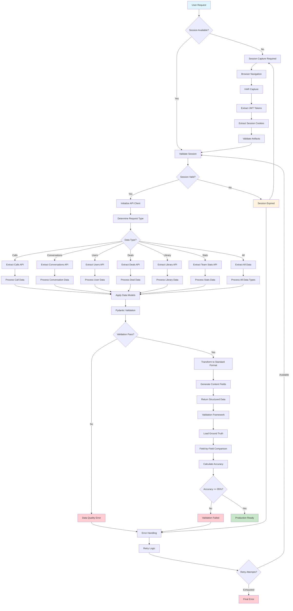

# Gong Agent Architecture Flowchart

This file should contain the visual flowchart for the Gong agent architecture.

## To generate the actual flowchart:

1. Install mermaid-cli: `npm install -g @mermaid-js/mermaid-cli`
2. Run: `mmdc -i flowchart.mmd -o architecture-flowchart.png`

## Mermaid Diagram Source:

## Alternative: Use online Mermaid editor

1. Go to https://mermaid.live/
2. Paste the diagram source above
3. Export as PNG
4. Save as architecture-flowchart.png
